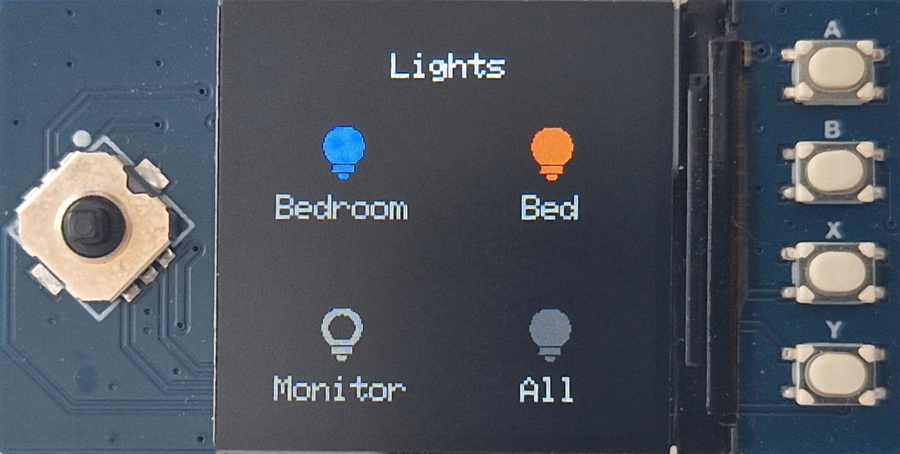
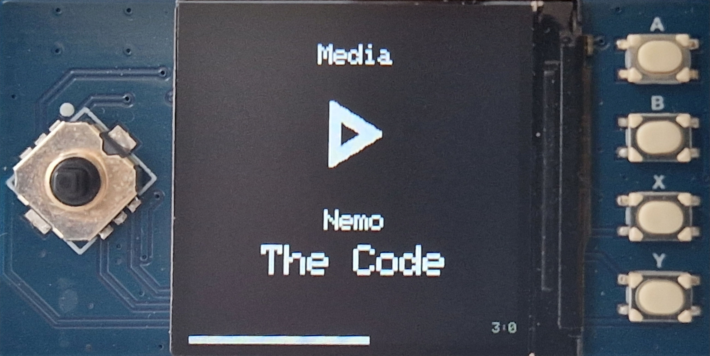
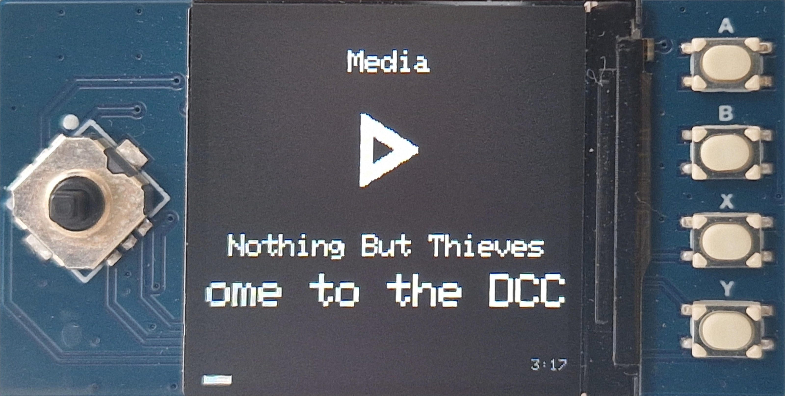

# Raspberry Pi Pico W Home Assistant Dashboard

## Requirements

- Raspberry Pi Pico W
- Waveshare 1.3" LCD display (part number [Pico-LCD-1.3](https://www.waveshare.com/product/pico-lcd-1.3.htm))
- WiFi network with WPA/WPA2/WPA3 Personal authentication within range
- [Home Assistant](https://www.home-assistant.io/)
- [`rshell`](https://github.com/dhylands/rshell) on a computer with a USB port
- A USB to Micro USB cable

## Installation

1. First flash the Pico W with the MicroPython firmware via the UF2 bootloader. [See Raspberry Pi's instructions.](https://www.raspberrypi.com/documentation/microcontrollers/micropython.html#drag-and-drop-micropython)

2. Then clone this repository:

    ```bash
    git clone https://github.com/mgrove36/home-assistant-pi-pico-w-dashboard.git && cd home-assistant-pi-pico-w-dashboard
    ```

3. Copy `env.sample.py` to `env.py` and edit it to contain [your settings](#settings).

4. Plug in the Pico W using a USB to Micro USB cable, and start `rshell`:

    ```bash
    rshell
    ```

5. Check the board is connected:

    ```bash
    boards
    ```
        
    Which should return something similar to the following:

    ```
    pyboard @ /dev/ttyACM0 connected Epoch: 1970 Dirs:
    ```

6. Copy the project onto the Pico W:

    ```bash
    cp -r * /pyboard/
    ```

The dashboard will now run whenever the Pico W is provided with power.

## Settings

The `env.py` file contains all settings for the dashboard. The variables are set as follows:

- `HOSTNAME`: The hostname of the Pi Pico W, used when connecting to WiFi.
- `SSID`: The SSID of the WiFi network to connect to.
- `WIFI_PASSWORD`: The WPA key (password) of the WiFi network to connect to.
- `HASS_URL`: The base URL of the Home Assistant instance to connect to. It should start with `http://` or `https://`, and **not** end in a `/`.
- `TOKEN`: The long-lived access token used to connect to Home Assistant. You can generate one by following the instructions [here](https://developers.home-assistant.io/docs/auth_api/#long-lived-access-token).
- `SCREENS`: A list of the screens to be displayed on the dashboard. Each screen is represented by a dictionary. Their requirements are detailed [below](#screens).

### Screens

The `SCREENS` settings variable is a list of dicts. Each dict must contain the following key-value pairs:

- `name`: A string, denoting the name of the screen to be displayed at the top of it.
- `type`: An integer:
    - `0`: A lights dashboard, for interacting with up to four light entities.
    - `1`: A media dashboard, for interacting with one media player entity.

Each dashboard type has additional required data, detailed below

#### Lights dashboards (type `0`)

Lights dashboards (type `0`) must contain the following additional key-value pairs:
- `entities`: A list of dicts, with each dict representing an individual light entity. Each dict must have the following key-value pairs:
    - `id`: A string, storing the entity ID of the light.
    - `name`: A string, storing a short name for the entity to display on the dashboard.

#### Media dashboards (type `1`)

Media dashboards (type `1`) must contain the following additional key-value pairs:
- `entity`: A string, storing the entity ID of the media player.

### Example `env.py` file

The below example file connects to Home Assistant at `https://hass.example.com` via a WiFi network named `MyNetwork`, and shows a dashboard with one lights screen and one media screen.

```py
HOSTNAME="mypico"
SSID = 'MyNetwork'
WIFI_PASSWORD = 'MyPassword'
HASS_URL = "https://hass.example.com"
TOKEN = "xxxx.xxxx.xxxx"
SCREENS = [
    {
        "name": "Downstairs",
        "type": 0,
        "entities": [
            {
                "id": "light.bedroom_light",
                "name": "Bedroom"
            },
            {
                "id": "light.kitchen_light",
                "name": "Kitchen"
            },
            {
                "id": "light.hallway_light",
                "name": "Hallway"
            },
            {
                "id": "light.downstairs_lights",
                "name": "Downstairs"
            }
        ]
    },
    {
        "name": "Living Room",
        "type": 1,
        "entity": "media_player.living_room"
    }
]
```

# Usage

Once the software has been installed as per [the instructions above](#installation), it will run whenever the Pico W is provided with power.

From any screen, left and right on the joystick will switch dashboard in either direction. The control button (press in on the joystick) will enable sleep mode. Sleep mode is also automatically enabled after 15 seconds of inactivity. The Pico W can be woken from sleep mode by pressing any button. Other buttons' functions depend on the dashboard type.

## Lights dashboards

- Up and down on the joystick changes the brightness of all switched-on lights by ±13.7% (35/255).
- Button A toggles the first light (top-left in the grid).
- Button B toggles the second light (top-right in the grid).
- Button X toggles the third light (bottom-left in the grid).
- Button Y toggles the fourth light (bottom-right in the grid).

When a light is enabled, its icon will be filled-in and coloured with the light's current colour.



## Media dashboards

- Up and down on the joystick changes the volume by ±8%.
- Button A plays/pauses the media player.
- Button B has no effect.
- Button X skips to the next track.
- Button Y skips to the previous track.

If the media title or artist is too long to fit on the display, the text will scroll to show the full information.



